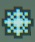

# Idle Boss Rush — Auto Freeze Clicker

Auto-clicker that detects and clicks **freeze** power-up icons in
[Idle Boss Rush](https://store.steampowered.com/app/3436030/IDLE_BOSS_RUSH/) (Steam).



## How it works

1. Captures a region of the screen at ~10 fps using [mss](https://github.com/BoboTiG/python-mss)
2. Converts to HSV and isolates cyan/blue pixels (the freeze icon color)
3. Applies morphological cleanup (dilate + erode) to merge nearby pixels
4. Finds contours and filters by:
   - **Area** — rejects noise (too small) and large UI elements (too big)
   - **Circularity** — freeze icons are roughly circular
   - **Mean brightness** — freeze icons have dimmer cyan pixels (mean V ≤ 175) compared to diamond collectibles (mean V ≈ 180-220), cleanly separating them
5. Clicks each detected icon via [pyautogui](https://github.com/asweigart/pyautogui)

## Requirements

- **Windows** — the game runs on Windows; screen capture and mouse control target the Windows desktop
- **Python 3.12+** on Windows
- **WSL2** (optional) — the wrapper script `run.sh` calls Windows `python.exe` from WSL

### Dependencies

```
opencv-python >= 4.9
numpy >= 1.26
mss >= 9.0
pyautogui >= 0.9
```

## Setup

### Option A: Windows (native)

```powershell
pip install opencv-python numpy mss pyautogui
python auto_freeze.py
```

### Option B: WSL2 → Windows

Install Python 3.12 on Windows, then from WSL:

```bash
# Install deps on the Windows Python
/mnt/c/Users/<you>/AppData/Local/Programs/Python/Python312/python.exe -m pip install opencv-python numpy mss pyautogui

# Edit run.sh to point PYTHON_EXE to your Windows Python path, then:
chmod +x run.sh
./run.sh
```

### Option C: Poetry (installable package)

```bash
poetry install
poetry run auto-freeze
```

## Usage

```
python auto_freeze.py [options]
```

| Flag | Description | Default |
|------|-------------|---------|
| `-i`, `--interval` | Seconds between screen scans | `0.1` |
| `-r`, `--region` | Screen capture region as `x,y,w,h` | `200,100,950,650` |
| `-v`, `--verbose` | Log every click | off |
| `--debug` | Save annotated screenshots per frame | off |

### Examples

```bash
# Default — scans the combat area at 10 fps
./run.sh

# Verbose logging (see each click)
./run.sh -v

# Custom region (full screen)
./run.sh -r 0,0,1920,1080

# Debug mode — saves annotated frames to debug_frame_NNNN.png
./run.sh --debug
```

**Fail-safe:** move your mouse to the top-left corner of the screen to instantly stop the script.

## Tuning

The detection constants are in `src/idle_boss_rush_auto_freeze/detector.py`:

| Constant | Description | Default |
|----------|-------------|---------|
| `HSV_LOWER` / `HSV_UPPER` | HSV range for cyan/blue color | `[90,80,150]` / `[115,255,255]` |
| `MIN_AREA` / `MAX_AREA` | Contour area bounds (pixels) | `150` / `800` |
| `MIN_CIRCULARITY` | Shape roundness threshold | `0.35` |
| `MAX_MEAN_V` | Maximum mean brightness of cyan pixels (rejects bright diamonds) | `175` |
| `DEFAULT_COMBAT_REGION` | Screen region to scan (in `__main__.py`) | `(200,100,950,650)` |

Use `--debug` mode to visualize what the detector sees:
- 🟢 **Green** — detected as freeze icon
- 🔴 **Red** — rejected by area filter
- 🟡 **Yellow** — rejected by circularity filter
- 🟠 **Orange** — rejected by mean brightness filter (likely a diamond)

## License

MIT
